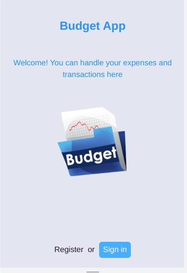
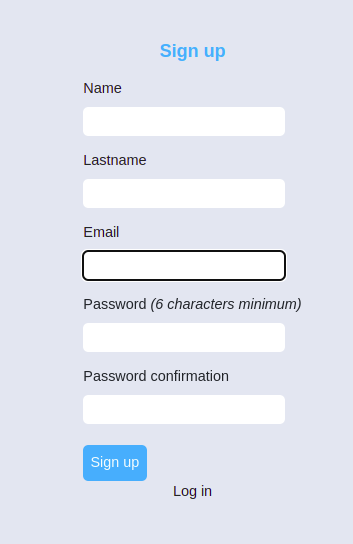
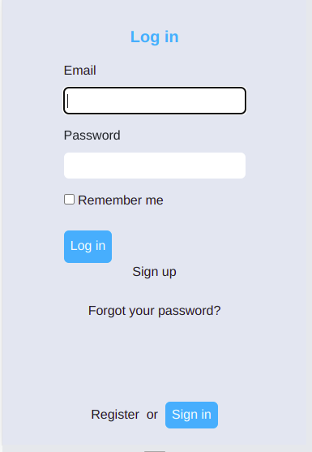
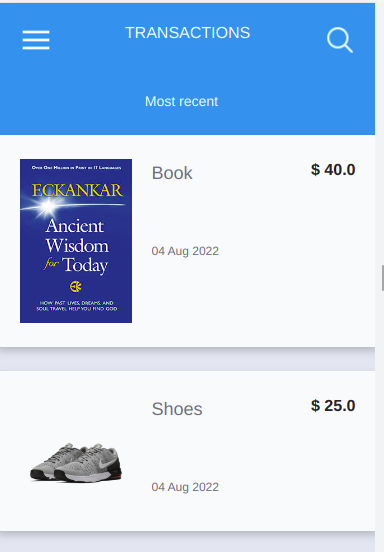
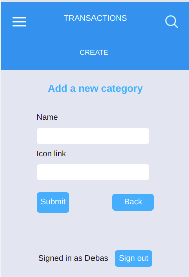

# Rails Budget App
> A Ruby on Rails capstone project about building a mobile web application where you can manage your budget: you have a list of transactions associated     with a category so that you can see how much money you spent and on what, and that allows the user to:
  - Register and log in so that the data is private to them.
  - Introduce new transactions associated with a category.
  - See the money spent on each category.

## Screenshot views
<div style="display: flex; flex-direction: row;">
   
  
  
</div>
<hr>
<div style="display: flex; flex-direction: row;">
 
 
</div>

## Built With
- Ruby
- Ruby on Rails
- PostgreSQL
- HTML
- TailwindCSS and CSS
## Live Demo
 [Live link](https://serene-ocean-56296.herokuapp.com/)
## prerequisites
- Text editor
- Ruby
- Ruby on Rails
- PostgresSQL
- Rspec
### Development (Running locally)

- git clone the project

```bash 
git clone https://github.com/Debas-31/rails-budget-app.git

cd rails-budget-app
```


### Setup

Install gems with:

```
bundle install
```

Setup database with:

```
rails db:create
rails db:migrate
```

### Usage

Start server with:

```
rails server
```

Visit http://localhost:3000/ in your browser.

### Run tests

Install npm with:

```
npm i
```

Install rspec with:

```
bundle install
```
Generate rspec:

```
rails generate rspec:install
```

Run the test with:

```
rspec spec
```


👤 **Debas Gebreslasie**

- [GitHub](https://github.com/Debas-31)
- [Twitter](https://twitter.com/DEBSH76956492)
- [LinkedIn](https://www.linkedin.com/in/debas-gebrengus)

## 🤝 Contributing

Contributions, issues and feature requests are welcome!

Feel free to check the [issues page](https://github.com/Debas-31/rails-budget-app/issues).

## Show your support

Give a ⭐️ if you like this project!

## Acknowledgments
- Ruby Community
- rails developers
- Gregoire Vella former product designer and Adobe Creative Cloud

## 📝 License

[MIT licensed](https://github.com/Debas-31/rails-budget-app/blob/dev/LICENSE).
```
